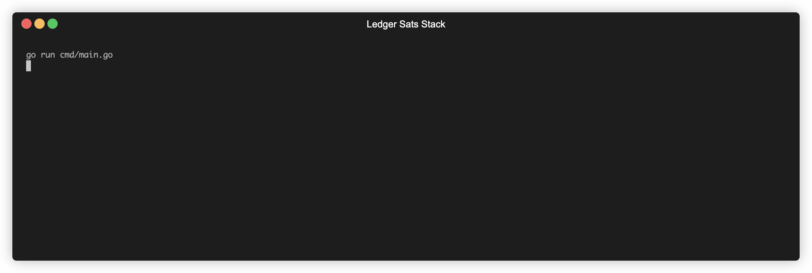

# Ledger SatStack


</h1>

Ledger SatStack is a lightweight bridge to connect Ledger Live with your personal Bitcoin full node. It's designed to allow Ledger Live users use Bitcoin without compromising on privacy, or relying on Ledger's infrastructure.

<p>
  
  
  
  
</p>




# Table of Contents

- [Background](#background)
- [Architecture](#architecture)
- [Requirements](#requirements)
- [Usage](#usage)
- [Contribute](#contribute)

## Background

Running a full node is the only way you can use Bitcoin in a completely trustless way. A full node downloads the entire blockchain, and checks it against Bitcoin's consensus rules, and contributes to the decentralization and economic strength of Bitcoin. However, a far more compelling reason to run your own node is **privacy**. [...read more](https://en.bitcoin.it/wiki/Full_node).

Running a node can be difficult for some users, and has [associated costs](https://bitcoin.org/en/full-node#costs-and-warnings) in terms of network bandwidth and disk usage. This is why Live connects to Bitcoin nodes running on Ledger's infrastucture, wrapped around by indexer and explorer services to ensure fast queries. While security and privacy is core to Ledger, one can make a theoretical case that Ledger can spy on transaction details, or even censor certain addresses from using Ledger's services.

SatStack aims to render Ledger's infrastructure dispensable, by allowing users to connect Ledger Live with their personal Bitcoin full node.


## Architecture

Ledger SatStack is a standalone Go application, that acts as a bridge between the [Ledger Live](http://ledger.com/live) application and a Bitcoin Core full-node. It exposes a REST interface to the open-source C++ library [libcore](https://github.com/LedgerHQ/lib-ledger-core), embedded by Live, and communicates to the Bitcoin node over RPC. It utilizes the transport layer and data-structures of [btcd](https://github.com/btcsuite/btcd).

<p align="center">
  
</p>

## Requirements

- Bitcoin Core **`0.20.0+`**.
- Ledger Live (desktop) **`2.5.0+`**.

## Usage

#### Retrieve descriptors from device

(coming soon) You'll soon be able to find this information directly on Ledger Live,
in your account settings.

If you are a first-time user of Ledger Live, you should retrieve your account xPubs
directly from your Ledger device, in order to avoid leaking your privacy. Simply follow
these steps:

1. Plug in your Ledger device via USB.
2. Enter your PIN code on the device, and open the Bitcoin app.
3. Run the `scripts/getdescriptor` script, as shown below.

```bash
$ cd scripts
$ python3 -m venv venv  # ensure Python 3.7+
$ source venv/bin/activate
(venv) $ pip install -r requirements.txt
(venv) $ ./getdescriptor --scheme native_segwit --chain main --account 3
wpkh([6e6a1271/84'/0'/3']xpubDCHCguj...mFJejwC/0/*)
```

#### Create configuration file

Create a config file **`lss.json`** in your home directory.
You can use [this](https://github.com/ledgerhq/satstack/blob/master/lss.mainnet.json) sample config file as a template.

###### Optional account fields

- **`depth`**: override the number of addresses to derive and import in the Bitcoin wallet. Defaults to `1000`.
- **`birthday`**: set the earliest known creation date (`YYYY/MM/DD` format), for faster account import.
Defaults to `2013/09/10` ([BIP0039](https://github.com/bitcoin/bips/blob/master/bip-0039.mediawiki) proposal date).
Refer to the table below for a list of safe wallet birthdays to choose from.

  | Event | Date (YYYY/MM/DD) |
  |-------|-------------------|
  | BIP0039 proposal created | 2013/09/10 (default) |
  | First ever BIP39 compatible Ledger device (Nano) shipped | 2014/11/24 |
  | First ever Ledger Nano S shipped | 2016/07/28 |

#### Launch Bitcoin full node

Make sure you've read the [requirements](#requirements) first, and that your node is configured properly.
Here's an example `bitcoin.conf`:

```
# Enable RPC server
server=1

# Set RPC credentials
rpcuser=<user>
rpcpassword=<password>
```

Then launch `bitcoind` like this:

```bash
$ bitcoind
```

#### Launch SatStack

Pre-built binaries are available for download on the [releases](https://github.com/ledgerhq/satstack/releases)
page (Linux, Windows, MacOS). Extract the tarball, and launch it as:

```sh
$ ./lss
```

If you want to build `lss` yourself, just do the following:

(make sure you have [mage](https://magefile.org) installed first)

```sh
$ mage release  # or "mage build" for a development build
```

On startup, SatStack will wait for the Bitcoin node to be fully synced,
and import your accounts. This can take a while.

#### Launch Ledger Live Desktop

```sh
$ git clone https://github.com/ledgerhq/ledger-live-desktop
$ cd ledger-live-desktop
$ yarn
$ EXPLORER=http://0.0.0.0:20000 yarn start
```

## Community

If you liked this project, show us some love by tweeting to us
[@Ledger](https://twitter.com/Ledger) and [@onybose](https://twitter.com/onybose).

Contributions in the form of code improvements, documentation, tutorials,
and feedback are most welcome.
